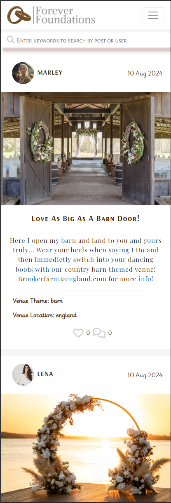

# Forever Foundations

## Project Purpose

Forever Foundations is a social media based platform designed to help users find their dream wedding venues. This website includes interaction such as posting, loving content, commenting on content and following accounts. However, your type of account will determine how much restrication you get across the website. This is to keep content relevant to the websites purpose.

You can visit the website here: [Forever Foundations]([https://forever-foundations-e27644123eb0.herokuapp.com/])

*********Responsive img here*************

 ## Planning

The 5 UX planes: strategy, scope, structure, skeleton, and surface - were used during the planning process of this project. Please do note whilst the planning is broken down the the end result will differ from the original planning as this project was a hands on learn as you go project. I found planning very helpful and very important with this project as it is the biggest project I have ever created/worked on. 

### The Strategy Plane

The egenda my project is built around is being able to connect people that are getting married or renewing their vows to be able to join a social, friendly and interactive platform to venue owners or representivies to secure their dream venue and destination. This also works hand in hand with the idea that this website was build with the idea that it would be a fun and easy was for venue owners to be able to showcase their venues and interact with their potential customers at the same time through the use of pictured content.

## Target Audience

The target audience for this particular project isn't only very exact but it's also very broad. As it doesn't take a certain person of any interest, age or gender to either look for a wedding venue of their own, help out loved ones with the search, list your own venue, list on behalf of your employer or list for your own business, it makes the perfect inclusive website that it open to everyone.

- People that are getting married and are looking for a venue
- People that are looking to renew their vows
- Venue owners that are looking to start to host weddings
- Company representatives that are looking to expand business for their employers
- Wedding planners that are looking to create wedding packages for customers
- Family and friends that are looking to help their loved ones find a venue
- People of any age and any gender

### First Time Visitor Goals:

- Visit the site and know the purpose immedietaly and navigate easily.
- View a page of posts without having to create an account.
- Be able to create an account quickly and easily.
- Be able to easily add my own pictures and posts.
- Have the ability to search for posts and profiles using keywords.

### Returning Visitor Goals:

- Easily locate back to posts I've liked to revisit or reply to any comments that have been made.
- Be able to follow new popular users profiles without having to navigate to their profiles.
- Add more of my own posts or comments.

## Project Goals

- Build a platform for a wide range of people
- Make it fun and interative
- Enable business users to share contact information
- Enable users to commumicate with others through the websites facilities
- The usage of CRUD functionality
- Connect customers with businesses
- Create an easy to use website
- Enable users to view content they took a liking to at a later date

## The Structure Plane

# The Agile Method

Before too much planning had gone into detail for this project I first started by creating a project board of user stories for this project. I found this much easier to work on each issue based on their priority rather than trying to get everything completed at the same time. 
Both the API and the Frontend stories are all here presented on one board to make things easier to locate and work on. [Here is the project user story board.](https://github.com/users/RachaelBull/projects/5)

Here I will explain the use and goals of my user stories and developer stories that have been split up into Epics:

### EPIC: Navigation

Title             | User Story                                                                                                                                                  | Priority         |
------------------|-------------------------------------------------------------------------------------------------------------------------------------------------------------|------------------|
 Routing          | As a *Site User*, I can navigate my way through the pages so that I can view content quickly without screen refresh.                                        | **MUST HAVE**    |
 Infinite Scroll  | As a *Site User*, I can keep scrolling through the content on the site that are loaded automatically so that I don't have to click between new pages.       | **MUST HAVE**    |
 Nav Bar          | As a *Site User*, I can view a navigation bar from every page on any device so that I can navigate easily through the websites contents.                    | **MUST HAVE**    |
 Burger Toggle    | As a *User* I can click a link from the nav dropdown in mobile view and have the burger menu collapse so that I can continue with the content on that page  | **MUST HAVE**    |
 Logo             | As a *User* I click on the logo so that I can navigate to the home page from any point on the site.                                                         | **SHOULD HAVE**  |

### EPIC: Profile

Title                        | User Story                                                                                                                                                  | Priority         |
-----------------------------|-------------------------------------------------------------------------------------------------------------------------------------------------------------|------------------|
 Edit Profile                | As a *User*, I can edit my existing profile so that I can have a customised version.                                                                        | **MUST HAVE**    |
 Follow Profiles             | As a *User* I can follow other peoples profiles so that I can keep updated with their content.                                                              | **MUST HAVE**    |
 Profile Icon Interactivity  | As a *User* I can click on the other users profile icon so that I can quickly view their profile without searching.                                         | **COULD HAVE**   |
 Profile Page                | As a *User*, I can view my own profile page by clicking on the profile link in the nav bar so that I can see my profile details.                            | **MUST HAVE**    |
 Change Password             | As a *User* I can update my password so that I can keep my account secure of any breaches.                                                                  | **SHOULD HAVE**  |

 ### EPIC: Home

Title                        | User Story                                                                                                                                                    | Priority         |
-----------------------------|---------------------------------------------------------------------------------------------------------------------------------------------------------------|------------------|
 Home Page                   | As a *User* I can view the home page so that I can view posts listed on there.                                                                                | **MUST HAVE**    |
 Home Page Redirect          | As a *User*, I can quickly be redirected to the home page after a successful sign in so that I can view the main page easily without having to navigate there | **MUST HAVE**    | 

 ### EPIC: Comments 

 Title                       | User Story/ Developer Story                                                                                                                                 | Priority         |
-----------------------------|-------------------------------------------------------------------------------------------------------------------------------------------------------------|------------------|
 Comments Model              | As a *Developer* I can allow users to comment on posts so that my site is inclusive of user interactivity.                                                  | **MUST HAVE**    |
 View Comments               | As a *User* I can view comments on posts so that I can join in on content interactions.                                                                     | **MUST HAVE**    |
 Delete Comments             | As a logged in *Site User*, I can delete comments that I have left on posts so that I can decide whether I want to keep them on there.                      | **MUST HAVE**    |
 Edit Comments               | As a logged in *Site User*, I am able to navigate back to comments I have created and edit them.                                                            | **MUST HAVE**    |
 Create Comments             | As a logged in *Site User*, I can leave comments on a post so that I can share my thoughts on the content.                                                  | **MUST HAVE**    |

 ### EPIC: Posts

  Title                       | User Story/ Developer Story                                                                                                                                 | Priority         |
------------------------------|-------------------------------------------------------------------------------------------------------------------------------------------------------------|------------------|
 List of popular venue owners | As a *User*, I am able to see a list of the most popular venue owners so that I can see which profiles are the most popular.                                | **SHOULD HAVE**  |
 Post Model                   | As a *Developer* I can allow venue users to create posts so that their accounts and content can keep my site up to date and relevant.                       | **MUST HAVE**    |
 Create Posts                 | As a *Venue User* I can create posts so that I can create content for my page.                                                                              | **MUST HAVE**    |
 View Posts                   | As a *User* I can view posts so that I can keep up to date with the sites content                                                                           | **MUST HAVE**    |
 Delete Post                  | As a *Venue User* I can delete my posts so that I can keep my account updated and to my liking.                                                             | **MUST HAVE**    |
 Filter Search Bar            | As a *User*, I can use the search bar with keywords so that I can easily find the posts and content that I am interested in.                                | **MUST HAVE**    |
 Filter Content               | As a *User* I can filter through the posts that I'd like to see so that I can keep up to date with the posts of my choosing                                 | **MUST HAVE**    |
 Edit Posts                   | As a *Venue User* I can edit my posts so that I can update my post to my preference.                                                                        | **MUST HAVE**    |
 Date and time stating        | As a *User*, I can see when posts were created and when comments were created so that I can tell how old the content is.                                    | **SHOULD HAVE**  |

### EPIC: Loves

  Title                       | User Story/ Developer Story                                                                                                                                 | Priority         |
------------------------------|-------------------------------------------------------------------------------------------------------------------------------------------------------------|------------------|
 Love Posts                   | As a *User* I am able to love react to posts so that I can share my passions and interest with the creator.                                                 | **SHOULD HAVE**  |
 Love Reactions Model         | As a *Developer* I can allow users to leave love reactions on posts so that they can express their interest to the post owners.                             | **MUST HAVE**    |
 Viewing Loved Content        | As a *User*, I can access a list of my loved content so that I can come back to the content at a later time with ease.                                      | **MUST HAVE**    |

### EPIC: Authentication

 Title                       | User Story/ Developer Story                                                                                                                                 | Priority         |
-----------------------------|-------------------------------------------------------------------------------------------------------------------------------------------------------------|------------------|
 Venue User Model            | As a *Developer* I can allow users to register as a venue account so that they have access to different features.                                           | **COULD HAVE**   |
 Logged In View              | As a *User* I can log in to my account and see the nav layout change so that I can have visual confirmation of my log in.                                   | **MUST HAVE**    |
 Sign Out                    | As a *User* I can sign out of my account so that I can keep my account safe whilst away from it.                                                            | **MUST HAVE**    |
 Sign In                     | As a *Site User*, I can easily sign in so that I can access all functionality for logged in users.                                                          | **MUST HAVE**    |

 # Design

These are the colours that I had chosen to base the design of my project around. These were decided from the type of categories I plan to include into my project, such as the words rustic, barn and classic. I felt like the brown and grey colours fit those descriptions perfectly. The Roseybrown colour was used as the 
colour background fill for the love icons. At first when they were implimented the colour of these were quite bright red. After looking further into it I decided that the original colour was too hard in comparison to the softer coloured design of the website as a whole.

# Chosen Fonts

A larger range of fonts were used for this project as I wanted to keep it interesting and looking nicely designed. I used the more italic style font for things such as the catergory filters when viewing a post or a list of posts. I also used this one for the followers count which is displayed at the side of 
the popular users section to the side of the page of posts. I felt like this added a more personal and homely touch to the project as it was more on the playful, less bold and elegent side. 

Whilst my aim was to still look professional and elegant, I opted for the other three more bold fonts to be implemented through the rest of the project. The boldness of some of these fonts with added font weight and letter spacing applied through styling made it stand out and look eyecatching to a user. Throughout the rest of the 
project these particular fonts are also played down in areas where they are not needed to appear so big and bold, giving the webpages that more softer, but still consistant look to the page.

# WIREFRAMES HERE

# Features

## The Home Page/Landing Page

As soon as entering into the website the user is taken straight to the landing/home page which consists of the most recently made posts and a list of popular profiles which are unable to be followed unless the user is logged in. They are also able to see the loves and comments icon, however they cannot use these feautures until they are logged in, which they 
are propted to do so once hovering over the icons.

## Sign Up

The sign up page consists of a widly spread attractive background picture with a form placed ontop of it with a dark faded background. Once the user has successfully created an account they will then be redirected to the sign in form.

