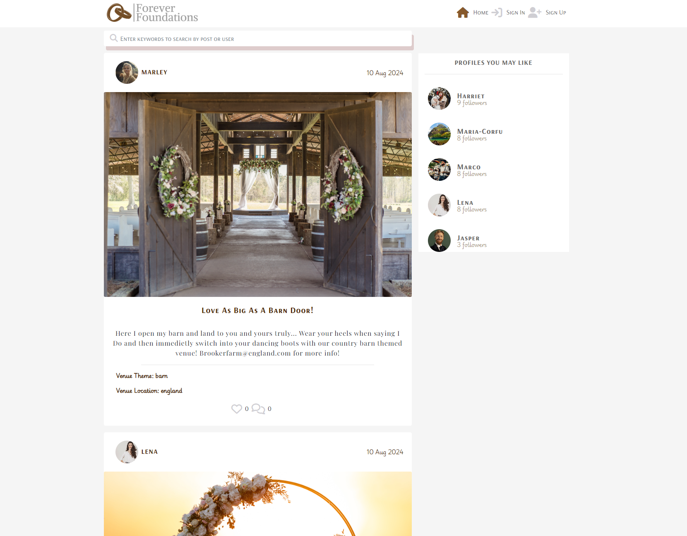

# Forever Foundations

## Project Purpose

Forever Foundations is a social media based platform designed to help users find their dream wedding venues. This website includes interaction such as posting, loving content, commenting on content and following accounts. However, your type of account will determine how much restrication you get across the website. This is to keep content relevant to the websites purpose.

You can visit the website here: [Forever Foundations](https://forever-foundations-e27644123eb0.herokuapp.com/)

 ## Planning

The 5 UX planes: strategy, scope, structure, skeleton, and surface - were used during the planning process of this project. Please do note whilst the planning is broken down the the end result will differ from the original planning as this project was a hands on learn as you go project. I found planning very helpful and very important with this project as it is the biggest project I have ever created/worked on. 

### The Strategy Plane

The egenda my project is built around is being able to connect people that are getting married or renewing their vows to be able to join a social, friendly and interactive platform to venue owners or representivies to secure their dream venue and destination. This also works hand in hand with the idea that this website was build with the idea that it would be a fun and easy was for venue owners to be able to showcase their venues and interact with their potential customers at the same time through the use of pictured content.

## Target Audience

The target audience for this particular project isn't only very exact but it's also very broad. As it doesn't take a certain person of any interest, age or gender to either look for a wedding venue of their own, help out loved ones with the search, list your own venue, list on behalf of your employer or list for your own business, it makes the perfect inclusive website that it open to everyone.

- People that are getting married and are looking for a venue
- People that are looking to renew their vows
- Venue owners that are looking to start to host weddings
- Company representatives that are looking to expand business for their employers
- Wedding planners that are looking to create wedding packages for customers
- Family and friends that are looking to help their loved ones find a venue
- People of any age and any gender

### First Time Visitor Goals:

- Visit the site and know the purpose immedietaly and navigate easily.
- View a page of posts without having to create an account.
- Be able to create an account quickly and easily.
- Be able to easily add my own pictures and posts.
- Have the ability to search for posts and profiles using keywords.

### Returning Visitor Goals:

- Easily locate back to posts I've liked to revisit or reply to any comments that have been made.
- Be able to follow new popular users profiles without having to navigate to their profiles.
- Add more of my own posts or comments.

## Project Goals

- Build a platform for a wide range of people
- Make it fun and interative
- Enable business users to share contact information
- Enable users to commumicate with others through the websites facilities
- The usage of CRUD functionality
- Connect customers with businesses
- Create an easy to use website
- Enable users to view content they took a liking to at a later date

## The Structure Plane

# The Agile Method

Before too much planning had gone into detail for this project I first started by creating a project board of user stories for this project. I found this much easier to work on each issue based on their priority rather than trying to get everything completed at the same time. 
Both the API and the Frontend stories are all here presented on one board to make things easier to locate and work on. [Here is the project user story board.](https://github.com/users/RachaelBull/projects/5)

Here I will explain the use and goals of my user stories and developer stories that have been split up into Epics:

### EPIC: Navigation

Title             | User Story                                                                                                                                                  | Priority         |
------------------|-------------------------------------------------------------------------------------------------------------------------------------------------------------|------------------|
 Routing          | As a *Site User*, I can navigate my way through the pages so that I can view content quickly without screen refresh.                                        | **MUST HAVE**    |
 Infinite Scroll  | As a *Site User*, I can keep scrolling through the content on the site that are loaded automatically so that I don't have to click between new pages.       | **MUST HAVE**    |
 Nav Bar          | As a *Site User*, I can view a navigation bar from every page on any device so that I can navigate easily through the websites contents.                    | **MUST HAVE**    |
 Burger Toggle    | As a *User* I can click a link from the nav dropdown in mobile view and have the burger menu collapse so that I can continue with the content on that page  | **MUST HAVE**    |
 Logo             | As a *User* I click on the logo so that I can navigate to the home page from any point on the site.                                                         | **SHOULD HAVE**  |

### EPIC: Profile

Title                        | User Story                                                                                                                                                  | Priority         |
-----------------------------|-------------------------------------------------------------------------------------------------------------------------------------------------------------|------------------|
 Edit Profile                | As a *User*, I can edit my existing profile so that I can have a customised version.                                                                        | **MUST HAVE**    |
 Follow Profiles             | As a *User* I can follow other peoples profiles so that I can keep updated with their content.                                                              | **MUST HAVE**    |
 Profile Icon Interactivity  | As a *User* I can click on the other users profile icon so that I can quickly view their profile without searching.                                         | **COULD HAVE**   |
 Profile Page                | As a *User*, I can view my own profile page by clicking on the profile link in the nav bar so that I can see my profile details.                            | **MUST HAVE**    |
 Change Password             | As a *User* I can update my password so that I can keep my account secure of any breaches.                                                                  | **SHOULD HAVE**  |

 ### EPIC: Home

Title                        | User Story                                                                                                                                                    | Priority         |
-----------------------------|---------------------------------------------------------------------------------------------------------------------------------------------------------------|------------------|
 Home Page                   | As a *User* I can view the home page so that I can view posts listed on there.                                                                                | **MUST HAVE**    |
 Home Page Redirect          | As a *User*, I can quickly be redirected to the home page after a successful sign in so that I can view the main page easily without having to navigate there | **MUST HAVE**    | 

 ### EPIC: Comments 

 Title                       | User Story/ Developer Story                                                                                                                                 | Priority         |
-----------------------------|-------------------------------------------------------------------------------------------------------------------------------------------------------------|------------------|
 Comments Model              | As a *Developer* I can allow users to comment on posts so that my site is inclusive of user interactivity.                                                  | **MUST HAVE**    |
 View Comments               | As a *User* I can view comments on posts so that I can join in on content interactions.                                                                     | **MUST HAVE**    |
 Delete Comments             | As a logged in *Site User*, I can delete comments that I have left on posts so that I can decide whether I want to keep them on there.                      | **MUST HAVE**    |
 Edit Comments               | As a logged in *Site User*, I am able to navigate back to comments I have created and edit them.                                                            | **MUST HAVE**    |
 Create Comments             | As a logged in *Site User*, I can leave comments on a post so that I can share my thoughts on the content.                                                  | **MUST HAVE**    |

 ### EPIC: Posts

  Title                       | User Story/ Developer Story                                                                                                                                 | Priority         |
------------------------------|-------------------------------------------------------------------------------------------------------------------------------------------------------------|------------------|
 List of popular venue owners | As a *User*, I am able to see a list of the most popular venue owners so that I can see which profiles are the most popular.                                | **SHOULD HAVE**  |
 Post Model                   | As a *Developer* I can allow venue users to create posts so that their accounts and content can keep my site up to date and relevant.                       | **MUST HAVE**    |
 Create Posts                 | As a *Venue User* I can create posts so that I can create content for my page.                                                                              | **MUST HAVE**    |
 View Posts                   | As a *User* I can view posts so that I can keep up to date with the sites content                                                                           | **MUST HAVE**    |
 Delete Post                  | As a *Venue User* I can delete my posts so that I can keep my account updated and to my liking.                                                             | **MUST HAVE**    |
 Filter Search Bar            | As a *User*, I can use the search bar with keywords so that I can easily find the posts and content that I am interested in.                                | **MUST HAVE**    |
 Filter Content               | As a *User* I can filter through the posts that I'd like to see so that I can keep up to date with the posts of my choosing                                 | **MUST HAVE**    |
 Edit Posts                   | As a *Venue User* I can edit my posts so that I can update my post to my preference.                                                                        | **MUST HAVE**    |
 Date and time stating        | As a *User*, I can see when posts were created and when comments were created so that I can tell how old the content is.                                    | **SHOULD HAVE**  |

### EPIC: Loves

  Title                       | User Story/ Developer Story                                                                                                                                 | Priority         |
------------------------------|-------------------------------------------------------------------------------------------------------------------------------------------------------------|------------------|
 Love Posts                   | As a *User* I am able to love react to posts so that I can share my passions and interest with the creator.                                                 | **SHOULD HAVE**  |
 Love Reactions Model         | As a *Developer* I can allow users to leave love reactions on posts so that they can express their interest to the post owners.                             | **MUST HAVE**    |
 Viewing Loved Content        | As a *User*, I can access a list of my loved content so that I can come back to the content at a later time with ease.                                      | **MUST HAVE**    |

### EPIC: Authentication

 Title                       | User Story/ Developer Story                                                                                                                                 | Priority         |
-----------------------------|-------------------------------------------------------------------------------------------------------------------------------------------------------------|------------------|
 Venue User Model            | As a *Developer* I can allow users to register as a venue account so that they have access to different features.                                           | **COULD HAVE**   |
 Logged In View              | As a *User* I can log in to my account and see the nav layout change so that I can have visual confirmation of my log in.                                   | **MUST HAVE**    |
 Sign Out                    | As a *User* I can sign out of my account so that I can keep my account safe whilst away from it.                                                            | **MUST HAVE**    |
 Sign In                     | As a *Site User*, I can easily sign in so that I can access all functionality for logged in users.                                                          | **MUST HAVE**    |

 # Design

These are the colours that I had chosen to base the design of my project around. These were decided from the type of categories I plan to include into my project, such as the words rustic, barn and classic. I felt like the brown and grey colours fit those descriptions perfectly. The Roseybrown colour was used as the 
colour background fill for the love icons. At first when they were implimented the colour of these were quite bright red. After looking further into it I decided that the original colour was too hard in comparison to the softer coloured design of the website as a whole.

# Chosen Fonts

A larger range of fonts were used for this project as I wanted to keep it interesting and looking nicely designed. I used the more italic style font for things such as the catergory filters when viewing a post or a list of posts. I also used this one for the followers count which is displayed at the side of 
the popular users section to the side of the page of posts. I felt like this added a more personal and homely touch to the project as it was more on the playful, less bold and elegent side. 

Whilst my aim was to still look professional and elegant, I opted for the other three more bold fonts to be implemented through the rest of the project. The boldness of some of these fonts with added font weight and letter spacing applied through styling made it stand out and look eyecatching to a user. Throughout the rest of the 
project these particular fonts are also played down in areas where they are not needed to appear so big and bold, giving the webpages that more softer, but still consistant look to the page.

# Wireframes

Before going ahead with too much coding on the project, I created wireframes for the main pages so that I had a solid picture to refer back to of the kind of styling and features I was aiming for.

## Home page as a signed out user

## Home page as a signed in user

## Sign up page

## Sign in page

## Create a post page

## Profile Page

# Features

## The Home Page/Landing Page

As soon as entering into the website the user is taken straight to the landing/home page which consists of the most recently made posts and a list of popular profiles which are unable to be followed unless the user is logged in. They are also able to see the loves and comments icon, however they cannot use these feautures until they are logged in, which they 
are propted to do so once hovering over the icons.

## Sign Up Page

The sign up page consists of a widly spread attractive background picture with a form placed ontop of it with a dark faded background. Once the user has successfully created an account they will then be redirected to the sign in form.

## Sign In Page

After the user has successfuly made an account with the website, or already has an account, then they can proceed to log in through this form which is also placed ontop of a widely spread background image.

## The Home page after sign in

The user is redirected and taken to this page after they have successfully signed in. This is very similar to the landing page without logging in however some of the extra given functionality is already visible. For example, the follow buttons to the side of the popular profiles.

## Creating a post

Located at the top of the page on the navigation bar the user will find a button 'Add Listing' which takes the user to a page that allows them to create their own posts. Before the post is submitted and posted successfully the user would have had to of met all of the requirements such as the correct image size and a required title for the post. Once the post is 
submitted and created the user will then be redirected to the post that they have just created but the posted version. From this point the user is then able to edit or delete their post.

## Editing a post

When a post is clicked or a post has just been created the user will be directed to the post detail page which will display their singular post. Here they have the option to edit their post by navigating to the three dots located at the top right hand side of the post and selecting the edit post option. The user can only peform these actions if they own the post. 
Once the post is uodated to their liking on the edit page, the user should then click the 'save changes' button and they will then again be redirected to their post detail page to view the updated version.

## Deleting a post

When the user is on the post detail page of a post that they own they also have the option to delete the post by clicking on the bin emoji. By clicking on this their post will delete from the site and their profile.

## Profile Page

Once a user signs up to the website and creates an account a profile is automatically created for them. But this only includes the followers count, posts count, following count, a default profile picture and their list of posts and username. The user can then, once logged in, go ahead and add to their profile. Features the user will be able to add is a 
bio about themselves in the 'About You' section of the edit form, the user can also supply their contact email, and the user can also change their profile image.

## Edit Profile Page

Here is where the user is now able to edit and update their profile:

## Comments

# Technologies, Libraries and Frameworks Used

* Javascript - this was used to provide interactivity across the site for it's users.
* HTML - this was used to proive structure to the website.
* CSS - this was used to add custom styling to the site.
* React - this is a Javascript Library used for user interface.
* [Balsamiq](https://balsamiq.com/) - to create the Wireframes shown.
* [Gitpod](https://www.gitpod.io/) - used as a cross platform IDE to deploy my workspace environment onto Github.
* [Cloudinary](https://cloudinary.com/) - used to store images.
* [Google Fonts](https://fonts.google.com/) - used to import the various fonts used.
* [Lucid](https://lucid.co/) - used to create the Data Models diagram.
* [Coolor](https://coolors.co/) - used to create the colour palette of the website.
* [Heroku](https://www.heroku.com/) - used for the hosting and deployment of the site.
* [Font Awesome](https://fontawesome.com/) - used for the icons across the website.
* [React Bootstrap](https://react-bootstrap.github.io/) - CSS framework to help build responsive websites.
* [Github](https://github.com/) - to store and display all files for the website.
* [Google Chrome Dev Tools](https://developer.chrome.com/docs/devtools/) - to troubleshoot, and help solve any bugs.
* [W3C Markup Validator](https://validator.w3.org/) - to check the source code of my HTML files for any bugs.
* [W3C CSS Validator](https://jigsaw.w3.org/css-validator/) - to check the source code of my CSS file for any bugs.

# Deployment

*Before you can deploy onto Heroku with your frontend you first want to create and ready your backend, information on how to do this will be provided first*

## Create & Ready the API

- Navigate to your workspace and open your env.py file (create one in the main directory if it hasn't already been created).
- Add the DATABASE_URL value from your cloud-based database and a SECRET_KEY value to the env.py file - note to make sure that this is not visibily pushed to Github.
- Open your settings.py file and import the env.py file and the DATABASE_URL and SECRET_KEY file paths to keep the information secure.
- Install Django and then update this to your requirements.txt file.
- Create your project.
- Add the STATIC files settings.
- Create a file within your workspace called Procfile (with a capital P) in the main directory, this will hold your Heroku deployment requirements.
- If you are including images to your project using cloud-based image storage, add the Cloudinary URL to your env.py file.
- Add the Cloudinary libraries to INSTALLED APPS in Settings.py.
- Add your IDE workspace and Heroku to ALLOWED_HOSTS in the Settings.py file.
- Make migrations and migrate. (python manage.py makemigrations, python manage.py migrate).
- Create new Django project - *django-admin startproject <home_api>*
- Create Superuser (email can be left blank) - *python manage.py createsuperuser (username>email>password1>password2)* this so that you can gain access to your admin panel if needed.
- Create however many apps you intend to use - *python manage.py startapp <nameofapp>*.
- Make sure your DEBUG is set to false in your Settings.py file before pushing your code and deploying.

## Deploying to Heroku

This site was deployed onto Heroku which is listed above in the technologies used. To do this yourself, please follow these steps:

- Navigate to Heroku and sign up/create an account with them.
- Click the 'New' button in the top right corner of the page.
- Select to create a new app.
- Enter the name you wish to use for the app.
- Select a region listed and create the app.
- Connect your Heroku project to your GitHub repository. Under deployment, choose GitHub and find the repository you'd like to connect.
- Once connected, go to the Settings tab and click on 'Reveal Config Vars'. Add the environment key & value variables used above in your env.py file (CLOUDINARY_URL, DATABASE_URL & SECRET_KEY).
- Next add DISABLE_COLLECTSTATIC and add 1 if this is to be disabled to prevent errors.
- Navigate to the Deploy section, click on Github for the deployment method (automatic or manual) and confirm.
- At the bottom of the deploy section, make sure you are connected to the main branch and then click Deploy Branch.
- You are now able to view your site if no errors occured.

## Connect the API & the Frontend

*Adding your Client Origin URLS*

* In Heroku, navigate to Settings:
* Add the following Config Vars; 'CLIENT_ORIGIN' : 'Your deployed React app URL', 'CLIENT_ORIGIN_DEV' : 'Your Gitpod preview link, without trailing slash'

*Frontend Requirements*

* Install Axios: 'npm install axios' (in the terminal).
* Create a folder in your Frontend repository called 'api' and then proceed to create a file inside named 'axiosDefaults.js'.
  * To configure Axios you will need to:
    -  Import Axios in 'axiosDefaults.js'
    -  Set up Axios:
       -  axios.defaults.baseURL = "Your Input"
          axios.defaults.headers['Content-Type'] = 'multipart/form-data';
          axios.defaults.withCredentials = true;
    - Import Axios into your App.js file

*Please do note that after any changes have been made to your reponsitories then you will need to manually deploy each time you push new code if you do not have automatic deployments active*

## Cloning

Navigate the the repository that you are wishing to clone.

- Click on the 'Code' drop down button.
- Click on HTTPS and copy the repository link provided.
- Open your IDE of choice (please ensure that you have git installed for the next steps).
- Type 'git clone copied-git-url' into the terminal.
- The project will now be cloned and ready for you to use.

## Forking

Navigate to the repository that you are wishing to Fork.

- On the top right of the page under the header, click the 'Fork' button.
- This will now have created a duplicate of the full project in your GitHub Repository ready for you to use.

# Credits

## Media Credits

- The No Results image was obtained [Here](https://www.flaticon.com/free-icons/no-results)
- Lena's profile picture was obtained [Here](www.freepik.com)
- Marco's profile picture was obtained [Here](https://www.freepik.com/free-photo/young-bearded-man-cafe-street-smokes-cigarette-romantic-guy-white-shirt-cap-suspenders-city-peaky-blinders-old-fashionable-retro_24299480.htm#fromView=search&page=1&position=2&uuid=9302bb8c-82d4-4fb9-ab3d-6ccfab8eeca3)
- Harriet's profile picture was obtained [Here](https://www.freepik.com/free-photo/elegant-woman-long-white-dress_4209524.htm#fromView=search&page=1&position=50&uuid=b16188e9-2fd7-409c-a244-3daed59041a0)
- Jasper's proifle picture was obtained [Here](https://www.freepik.com/free-photo/van-gogh-portrait_32473797.htm#fromView=search&page=1&position=5&uuid=991848b9-c8fa-4770-8b26-508ea7c4ec39)
- Marley's profile picture was obtained [Here](https://www.freepik.com/free-ai-image/portrait-millennial-woman-living-country-side-after-moving-from-city_151970673.htm#fromView=search&page=1&position=29&uuid=8ebeb4b9-ad65-49e9-a68a-2d8190f770a5)
- All post images were obtained [Here](https://www.shutterstock.com/discover/stock-assets-uk-0220?cr=ec&ds_ag=FF%3DBrand-Shutterstock_Exact_AU%3DProspecting&ds_agid=58700001307463988&ds_cid=71700000014796324&ds_eid=700000001391652&gad_source=1&gclid=CjwKCAjwwr6wBhBcEiwAfMEQs86p6Q9wc4ECy596PyYFrjOs97qUJ-EtqQahUwRw1lh6sKMIGQj74hoCh0UQAvD_BwE&gclsrc=aw.ds&kw=shutterstock&pl=PPC_GOO_UK_BD-675923695165&utm_campaign=CO%3DUK_LG%3DEN_BU%3DIMG_AD%3DBRAND_TS%3Dlggeneric_RG%3DEUAF_AB%3DACQ_CH%3DSEM_OG%3DCONV_PB%3DGoogle&utm_medium=cpc&utm_source=GOOGLE)

## Help Resources

- The [React Bootstrap website](https://react-bootstrap-v4.netlify.app/) helped me figure out the design and layout of my website as it offers easy mobile first view styling, saving a lot of time.
- I used the 'Moments' walkthrough by Code Institute to help with some setup and coding.
- The Tutoring team have been an amazing help throughout my project and have provided amazing feedback whenever I've come across an error I felt like I needed extra support with.